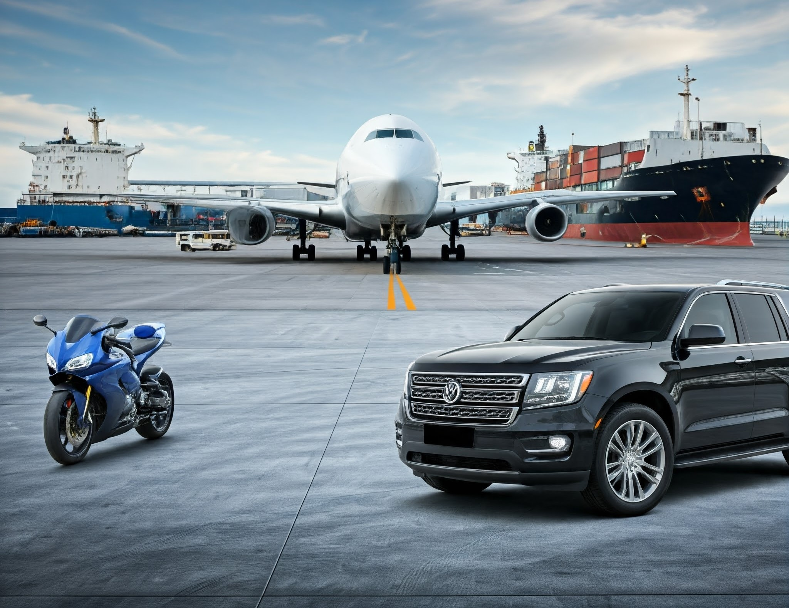

# Vehicle Image Classification

Classifying vehicle images into seven categories using convolutional neural networks, framed
around automating manual vehicle inspection at a port of entry.

---

## Results

5,590 images, seven balanced categories, 80/20 stratified split, 5 epochs each.
Random guessing scores **0.143**.

| Model | Trainable params | Best val accuracy | Final val loss |
|---|---|---|---|
| CNN, no augmentation | 1.85M | 0.779 | 0.659 |
| CNN + augmentation | 1.85M | 0.148 | 1.946 |
| **VGG19 transfer learning** | 8.0M (+20.0M frozen) | **0.922** | 0.271 |

**Transfer learning is what carries this.** VGG19 reached 0.883 after one epoch, higher than
the from-scratch CNN managed in five. Frozen ImageNet features already encode most of what
separates a ship from a motorcycle, leaving only the classifier head to learn.

### The augmented CNN failed, and it is reported as a failure

Its final validation accuracy of 0.146 is chance on seven classes, and its loss sat at 1.946
for all five epochs. That is `ln(7) = 1.9459`, the exact value cross-entropy returns when a
model predicts a uniform distribution over every class. The network never moved off the
plateau.

Architecture, learning rate and epochs were identical to the CNN that reached 0.779. The only
change was `augment=True` on the training generator. VGG19 uses the same augmentation and
reaches 0.922, so the augmentation is not broken in itself. The likely explanation is that a
two-convolution network with 16 and 32 filters, plus 50% dropout, lacks the capacity to find
structure in heavily transformed images in five epochs.

That remains a hypothesis. It is written up as a failed training run rather than presented as
a finding about augmentation, because that is what it is.

### Caveats on the 92.2%

- The 20% split was passed as `validation_data` during training and then used to compare
  models, so it informed model selection. It is an optimistic estimate, not a clean one.
- No confusion matrix or per-class precision and recall. For a customs use case, confusing a
  car with a motorcycle is a different problem from confusing a plane with a ship, and nothing
  here distinguishes them.
- No early stopping. VGG19 peaked at epoch 4 (0.922) and fell back at epoch 5 (0.915), so the
  saved model is not the best one observed.

---

## Data

Not stored in this repository. Download from Kaggle and unzip into `data/` so the layout is
`data/Vehicles/<category>/`:

- [Vehicles Dataset](https://www.kaggle.com/datasets/aiomarrehan/vehicles-dataset) — 5,590
  images across the seven classes used here

Categories: Auto Rickshaws, Bikes, Cars, Motorcycles, Planes, Ships, Trains. Roughly 800
images each, with Cars slightly under at 790.

---

## Approach

1. Build a dataframe of file paths and labels, check class balance, missing values and duplicates
2. Inspect image dimensions and aspect ratios across a 3,000-image sample
3. Label-encode categories, stratified 80/20 split
4. Train three models: a baseline CNN, the same CNN with augmentation, and VGG19 with a frozen
   convolutional base
5. Compare validation accuracy and loss across epochs

Images are resized to 128×128 and scaled to [0, 1] by a custom Keras `Sequence` generator that
loads from disk in batches rather than holding the dataset in memory.

---

## Running it

```bash
pip install -r requirements.txt
jupyter notebook vehicle_classification.ipynb
```

Training VGG19 takes roughly 10 minutes per epoch on CPU. The other two are considerably
faster.

---

## Next

Add a genuine three-way train/validation/test split and report per-class metrics with a
confusion matrix. Train longer with early stopping and checkpoint on best validation loss.
Fine-tune the upper VGG19 blocks once the head has converged. Step the augmentation strength
down until the small CNN trains, to confirm the capacity explanation for the collapse.
