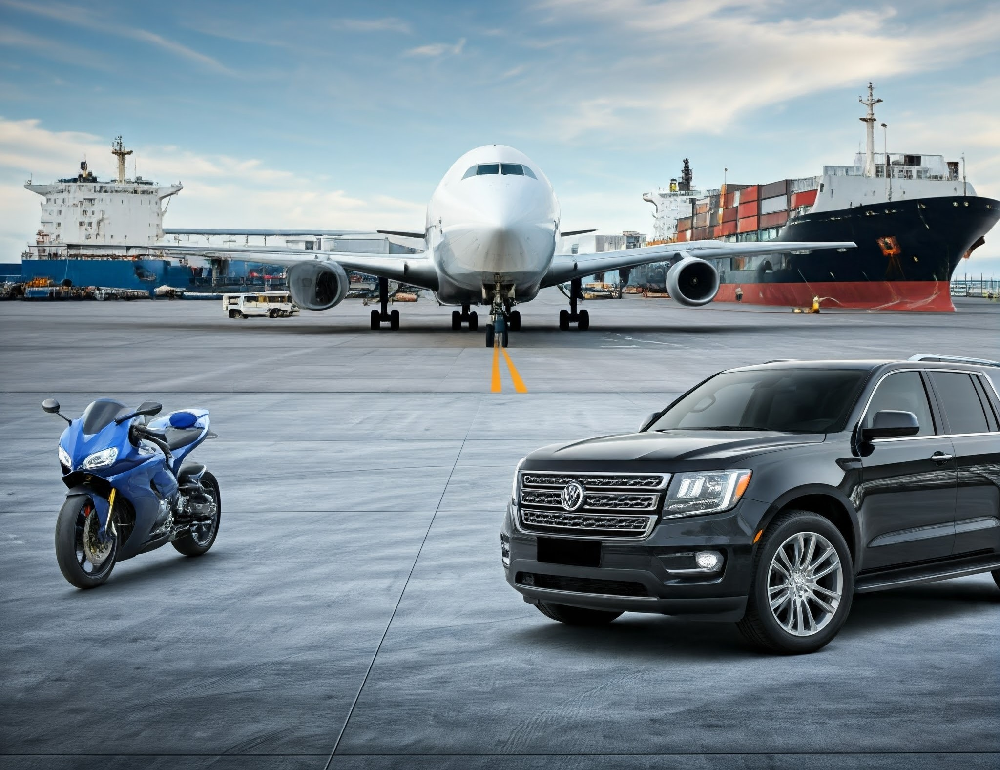

# Vehicle Image Classification Project

## Introduction
This project focuses on developing a deep learning model to classify vehicle images into different categories. The primary goal is to leverage Convolutional Neural Networks (CNNs) to accurately identify various vehicle types and enhance image classification capabilities. By creating a robust model, we aim to improve accuracy in identifying vehicles, which can be beneficial for applications such as automated parking systems, traffic monitoring, and fleet management.

## Objective
The main objective is to build a vehicle image classification model that can:
- Classify images into various vehicle categories (e.g., cars, trucks, motorcycles, buses).
- Analyze the model's performance and optimize it for better accuracy.
- Deploy the model for real-world applications.

## Data
The analysis utilizes a dataset containing images of different vehicle types. The dataset comprises:
- **Training Set**: Contains images labeled by category to train the model.
- **Validation Set**: Used to evaluate the model's performance during training.
- **Test Set**: Evaluates the final model's performance on unseen data.

The images are pre-processed (resized, normalized) to ensure compatibility with the CNN architecture.

## Modeling
The following models were built and evaluated:
- **Convolutional Neural Network (CNN)**: The baseline model for image classification.
- **Transfer Learning Models**: Utilized pre-trained models (e.g., VGG19) to improve classification accuracy.
- **Hyperparameter Tuning**: Implemented techniques like GridSearchCV to optimize model parameters.

